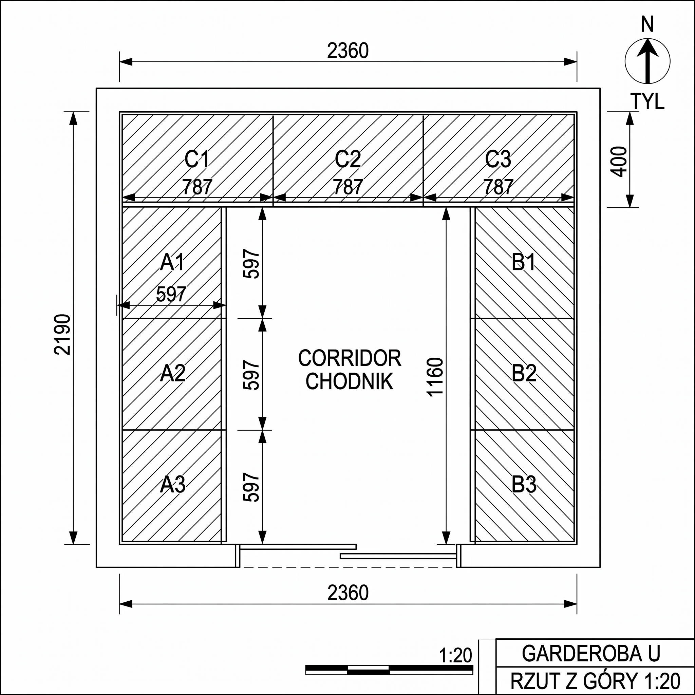
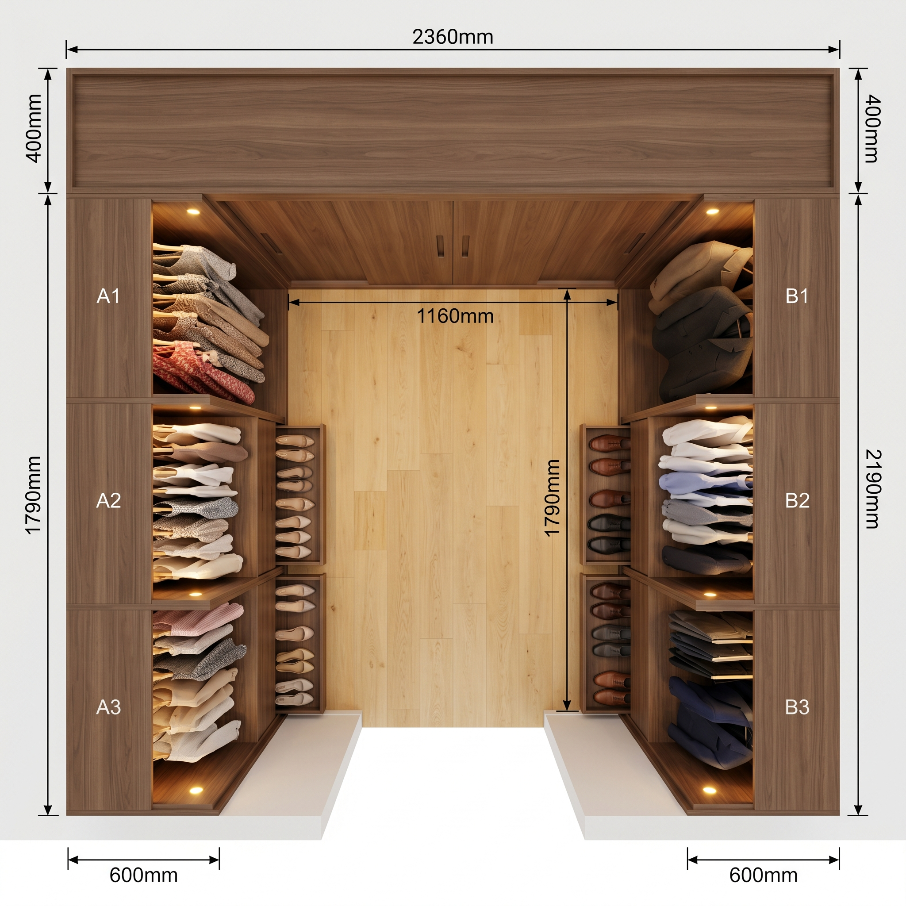
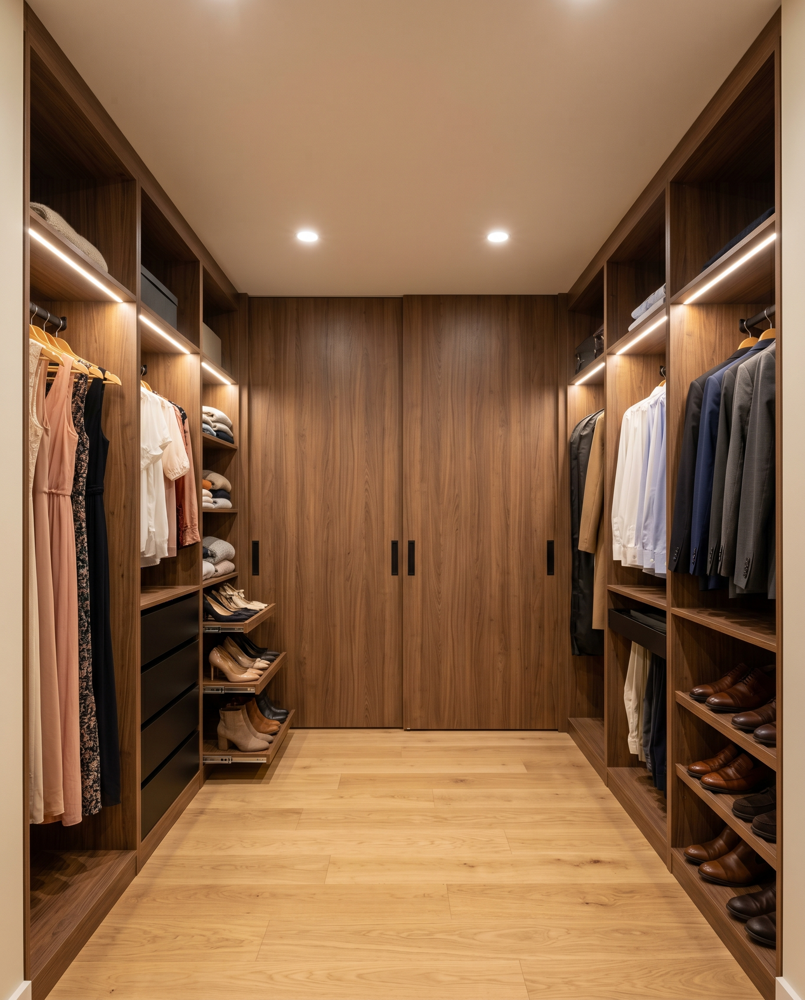
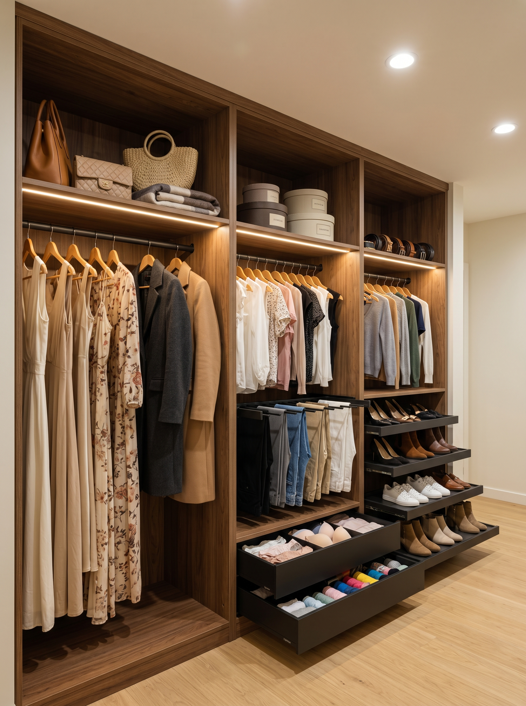
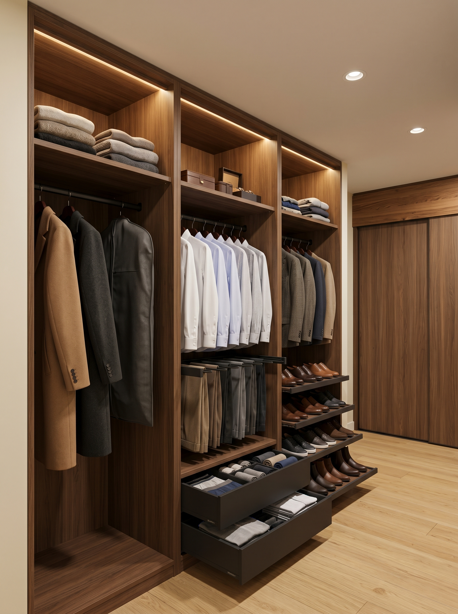
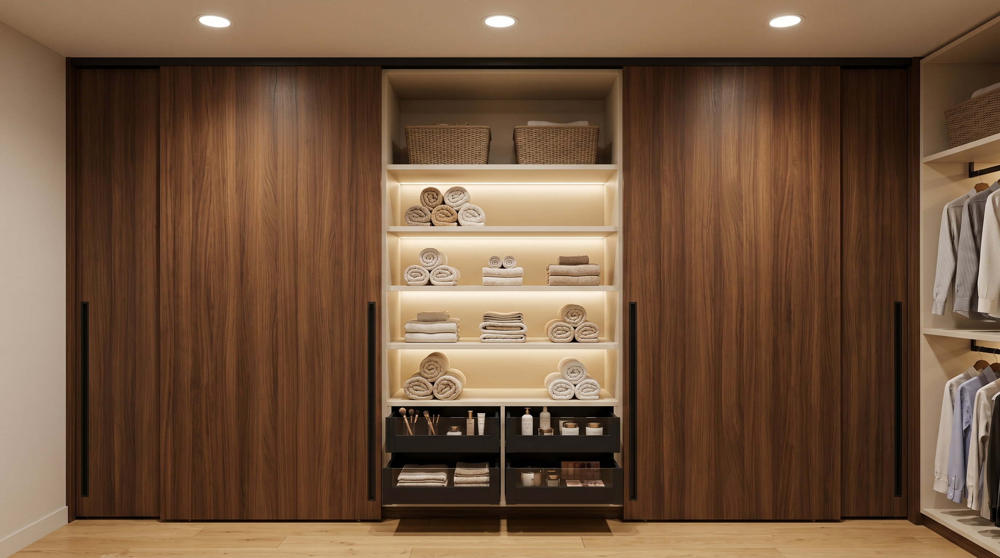

# Garderoba U-shape — Orzech Royal

Projekt zabudowy walk-in w sypialni. Wykonanie: **Korner Żary** (płyta meblowa Egger).

---

## Spis treści

1. [Pomieszczenie](#pomieszczenie)
2. [Materiały](#materiały)
3. [Układ — rzut z góry](#układ--rzut-z-góry)
4. [Moduły — specyfikacja](#moduły--specyfikacja)
   - [Lewa ściana (ONA)](#lewa-ściana-ona)
   - [Prawa ściana (ON)](#prawa-ściana-on)
   - [Tylna ściana (wspólne)](#tylna-ściana-wspólne)
5. [Drzwi przesuwne tyłu](#drzwi-przesuwne-tyłu)
6. [Oświetlenie LED](#oświetlenie-led)
7. [Okucia i akcesoria](#okucia-i-akcesoria)
8. [Co zrobić przed Kornerem](#co-zrobić-przed-kornerem)
9. [Rendery](#rendery)

---

## Pomieszczenie

| Parametr | Wartość |
|---|---|
| Szerokość (ściana tylna i frontowa) | **2360 mm** |
| Głębokość (ścianki boczne) | **2190 mm** |
| Wysokość sufitu GK (po panelach) | **2490 mm** |
| Wnęka centralna w suficie | usunięta — sufit płaski |
| Drzwi wejściowe (od sypialni) | wykonane osobno (poza zakresem) |

---

## Materiały

| Element | Materiał | Producent |
|---|---|---|
| Korpusy szafek | **Egger H3734 ST9 Pacific Walnut** (Orzech Royal) 18 mm | Korner |
| Półki ruchome | Egger H3734 ST9 18 mm, krawędź ABS 2 mm | Korner |
| Plecy | HDF lakierowany w dekorze H3734, 8 mm | Korner |
| Cokoły | Egger H3734 18 mm, wysokość 100 mm | Korner |
| Maskownica górna | Egger H3734 18 mm, wysokość 20 mm | Korner |
| Fronty drzwi przesuwnych tyłu | Egger H3734 ST9 18 mm, krawędzie ABS 2 mm wszystkie strony | Korner |
| Podłoga (kontynuacja sypialni) | Barlinek Almond (jasny dąb) | poza Korner |

---

## Układ — rzut z góry


```
        ←────────────── 2360 mm (ściana tylna) ──────────────→
        ┌──────────────────────────────────────────────────────┐ ↑
   400  │  ╔═══════╦════════╦═══════╗   drzwi przesuwne:       │ │
   mm   │  ║  C1   ║   C2   ║   C3  ║   2 × 1180 × 2470 mm    │ │
   szafa│  ║ 786   ║  787   ║  787  ║   Orzech Royal           │ │
   TYL  │  ╚═══════╩════════╩═══════╝                          │ ↓
        ├──────────┬──────────────────────┬──────────────────┤ ↑
        │ ╔══════╗ │                      │ ╔══════╗          │ │
        │ ║  A1  ║ │                      │ ║  B1  ║          │ │
        │ ║ 596  ║ │                      │ ║ 596  ║          │ │
        │ ╠══════╣ │     CHODNIK          │ ╠══════╣          │ │
        │ ║  A2  ║ │   1160 × 1790 mm     │ ║  B2  ║          │ │ 1790 mm
        │ ║ 597  ║ │                      │ ║ 597  ║          │ │
        │ ╠══════╣ │                      │ ╠══════╣          │ │
        │ ║  A3  ║ │                      │ ║  B3  ║          │ │
        │ ║ 597  ║ │                      │ ║ 597  ║          │ │
        │ ╚══════╝ │                      │ ╚══════╝          │ ↓
        │  600 mm  │   chodnik 1160 mm    │  600 mm           │
        │ szafa A  │                      │  szafa B          │
        ├──────────┴──────────────────────┴──────────────────┤
        │              FRONT 2360 mm (drzwi user)            │
        └──────────────────────────────────────────────────────┘
```

**Weryfikacja:**

| Kierunek | Suma | Wymóg | OK |
|---|---|---|---|
| Szerokość | 600 + 1160 + 600 | = 2360 mm | ✓ |
| Głębokość | 400 + 1790 | = 2190 mm | ✓ |
| Wysokość | 100 (cokół) + 2370 (korpus) + 20 (maskownica) | = 2490 mm | ✓ |

---

## Moduły — specyfikacja

### Lewa ściana (ONA)

**3 moduły × 596–597 × 600 × 2470 mm**, otwarte (bez frontów). **Lustrzanie symetryczne do prawej (ON).**

| Moduł | Wymiar (W×D×H) mm | Strefa góra (h=500) | Strefa środek | Strefa dół |
|---|---|---|---|---|
| **A1** | 596 × 600 × 2470 | antresola otwarta | drążek długi **h=1800** (sukienki, płaszcze) | — |
| **A2** | 597 × 600 × 2470 | antresola otwarta | drążek krótki **h=1100** (bluzki) + **pantograf na 6 par spodni** poniżej | **3× szuflada Legrabox H134** (bielizna, biustonosze, skarpetki) |
| **A3** | 597 × 600 × 2470 | antresola otwarta | drążek krótki **h=1100** (swetry/bluzki) | **4× wysuwana półka na buty** (12 par damskich) |

### Prawa ściana (ON)

**3 moduły × 596–597 × 600 × 2470 mm**, otwarte (lustrzanie do ONA).

| Moduł | Wymiar (W×D×H) mm | Strefa góra (h=500) | Strefa środek | Strefa dół |
|---|---|---|---|---|
| **B1** | 596 × 600 × 2470 | antresola otwarta | drążek długi **h=1800** (długie kurtki, garnitur w pokrowcu) | — |
| **B2** | 597 × 600 × 2470 | antresola otwarta | drążek krótki **h=1100** (koszule) + **pantograf na 6 par spodni** poniżej | **3× szuflada Legrabox H134** (bielizna, skarpetki, t-shirty) |
| **B3** | 597 × 600 × 2470 | antresola otwarta | drążek krótki **h=1100** (marynarki, kurtki) | **4× wysuwana półka na buty** (12 par męskich) |

### Tylna ściana (wspólne)

**3 moduły × 786–787 × 400 × 2470 mm**, zamknięte drzwiami przesuwnymi.

| Moduł | Wymiar (W×D×H) mm | Strefa góra (h=500) | Strefa środek | Strefa dół |
|---|---|---|---|---|
| **C1** | 786 × 400 × 2470 | antresola | **4 półki otwarte** (kosze, walizki, akcesoria) | **3× Legrabox H192** (pościel) |
| **C2** | 787 × 400 × 2470 | antresola | **5 półek otwartych na ręczniki** (rolowane) + **taśma LED 3000K** pod każdą półką | **2× Legrabox H192** (kosmetyki) |
| **C3** | 787 × 400 × 2470 | antresola | jak C1 lustrzanie — 4 półki (sezonowe, walizki) | **3× Legrabox H192** (pościel zapas) |

---

## Drzwi przesuwne tyłu

| Parametr | Wartość |
|---|---|
| Liczba paneli | 2 |
| Wymiar pojedynczego panelu | **1180 × 2390 mm** |
| Zachód paneli | 5 mm w środku |
| Materiał | Płyta meblowa MDF 18 mm + okleina **Egger H3734 ST9 Pacific Walnut** |
| Krawędzie | ABS 2 mm wszystkie strony |
| **Header (top panel szafy C)** | **2360 × 400 × 18 mm** w Orzechu Royal — górna pozioma płyta szafy tylnej; pełni rolę: (1) sufit szafy C, (2) nośnik prowadnicy drzwi przesuwnych, (3) widoczny "fryz" architektoniczny 70 mm od dołu |
| System | **Sevroll Slim 25** (lub Hettich Top Line) — prowadnica górna **mocowana wkrętami w drewniany header od dołu** |
| Uchwyt | profil pionowy wpuszczany **czarny mat**, na pełną wysokość (np. Sevroll Lounge) |
| Soft-close | obustronny (Sevroll Soft Stop) |
| Mocowanie dolne | dolna prowadnica frezowana w panel podłogowy 3 mm |

**Cena orientacyjnie:** 1500–2000 zł (zestaw 2 panele Orzech Royal + system Sevroll Slim 25 + header).

**Zalety vs prowadnica w suficie GK:**
- Tańsze o 600-1000 zł
- Nie wymaga przygotowania GK (poprzeczka UA50, rowek frezowany) → mniej pracy ekipy budowlanej
- Cała konstrukcja "od góry do dołu" w Orzechu Royal — pełna integracja architektoniczna
- Header sam w sobie staje się elementem dekoracyjnym

---

## Oświetlenie LED

| Lokalizacja | Typ | Wymiar | Moc | Kolor | Sterowanie |
|---|---|---|---|---|---|
| Antresola modułów A1–A3 | taśma LED 24V | 580 mm każda × 3 = 1740 mm | 7,2 W/m | 3000 K | czujnik PIR drzwi |
| Antresola modułów B1–B3 | taśma LED 24V | 580 mm każda × 3 = 1740 mm | 7,2 W/m | 3000 K | czujnik PIR drzwi |
| Pod 5 półkami ręczników w C2 | taśma LED 24V | 770 mm × 5 = 3850 mm | 7,2 W/m | 3000 K | wyłącznik dotykowy w drzwiach przesuwnych |
| Sufit GK nad chodnikiem | 3× spot LED wpuszczany | Ø 80 mm | 12 W | 3000 K | wyłącznik klawiszowy ścienny |
| **Razem LED 24V** | | ~5,3 m | ~38 W | | **zasilacz Mean Well 60W 24V IP20** |

**Marka rekomendowana:** Paulmann YourLED ECO 24V (lub Eglo / Philips Hue Lightstrip dla sterowania appką).

---

## Okucia i akcesoria

| Element | Marka / Model | Sztuk |
|---|---|---|
| Szuflady wewnętrzne H134 (boczne A2, B2) | **Blum Legrabox K** wysokość 134 mm + cichy domyk | 6 |
| Szuflady wewnętrzne H192 (tył C1, C2, C3) | **Blum Legrabox C** wysokość 192 mm + cichy domyk | 8 |
| Drążek pantograf na spodnie (A2, B2) | **Hettich** wysuwany | 2 |
| Wysuwane półki na buty (A3, B3) | **Hettich** prowadnice kulkowe pełnego wysuwu | 8 |
| Drążek wieszakowy w antresoli | aluminium owalne, czarny mat 30 × 15 mm | 6 |
| Nogi regulowane cokołu | **Hettich** wys. 100 mm, regulacja ±15 mm | 24 |
| Zawiasy frontów C1, C3 (jeśli klasyczne) | nie dotyczy (drzwi przesuwne) | — |
| Prowadnica drzwi przesuwnych C | **Sevroll Slim 25** lub Komandor | 1 zestaw |

---

## Co zrobić przed Kornerem

1. **Pomiar 2× w 3 miejscach** (góra / środek / dół) na 3 ścianach + sprawdzenie kątów (90° tolerancja ±5 mm) — ścianki GK mogą mieć krzywizny
2. **Wykończyć ściany** (gładź, malowanie kremową farbą — kolor wnętrza widać tylko w bocznicach otwartych)
3. **Zamontować sufit GK** na docelowej wysokości 2490 mm — **standardowo, bez przygotowań**. Prowadnica drzwi przesuwnych mocowana jest do drewnianego headera szafy tylnej (od dołu), nie do GK.
4. **Wyprowadzić zasilanie** w cokole tylnej ściany pod modułem C2 (kabel YDY 3×1,5 mm² zakończony puszką) — dla zasilacza LED 24V
5. **Wyprowadzić zasilanie** w suficie GK nad chodnikiem (3 punkty) — dla spotów ledspot
6. **Ułożyć podłogę panele** Barlinek Almond do wewnątrz garderoby (kontynuacja sypialni)
7. **Sprawdzić nośność sufitu GK** — prowadnica drzwi przesuwnych mocowana do profili CD60, w razie potrzeby wzmocnić poprzeczką UA50 między 2 sąsiednimi CD60
8. **Wysłać Kornerowi:**
   - Niniejszy dokument
   - Rysunek `renders/U-16-cad-plan.png`
   - Foto 4 ścian + sufit + podłoga (każda osobno)
   - Wymiary z pomiaru z punktu 1 (jako tabela)

---

## Rendery

### CAD rzut techniczny z wymiarami


### Rzut z góry fotorealistyczny (potwierdza kształt U)


### Widok od wejścia


### Lewa ściana ONA — detale modułów


### Prawa ściana ON — detale modułów


### Tylna ściana — drzwi przesuwne z odsuniętym panelem

